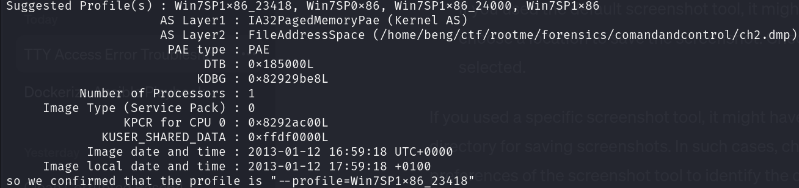

We possess a 'ch2.dmp' memory file with a size of 537 MB, indicating substantial RAM capacity. Initially, we will confirm the profile of this memory using Volatility 2
```bash
python2 ~/volatility/vol.py -f ch2.dmp imageinfo
```
we get this output here :

**so we confirmed that the profile is:** "--profile=Win7SP1x86_23418"


