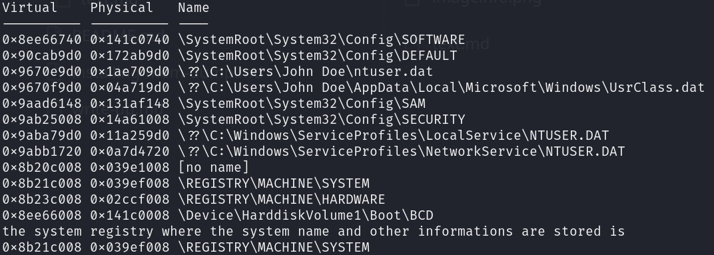
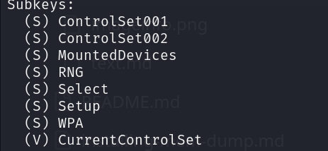

We possess a 'ch2.dmp' memory file with a size of 537 MB, indicating substantial RAM capacity. Initially, we will confirm the profile of this memory using Volatility 2
```bash
python2 ~/volatility/vol.py -f ch2.dmp imageinfo
```
we get this output here :


**so we confirmed that the profile is:** "--profile=Win7SP1x86_23418"
Next, we'll use the "hivelist" plugin to find the System host-name from the memory dump. This plugin lists the active registry hives, which are like specific folders in the Windows Registry—a digital filing cabinet that stores essential instructions for the computer's behavior and program settings. Each registry hive represents a dedicated section for specific configurations, such as personal preferences or system-wide settings.
by running this command : 

```bash
python2 ~/volatility/vol.py -f ch2.dmp --profile=Win7SP1x86_23418 hivelist
```
**Here, we obtain the registry hives:**


So what we will do to get the workstation's hostename from it?
First, we use the "printkey" option to specify the key value of the registry folder like this :
```bash
python2 ~/volatility/vol.py -f ch2.dmp --profile=Win7SP1x86_23418 printkey -o 0x8b21c008
```
Now we can see all subkeys of the system registry :



