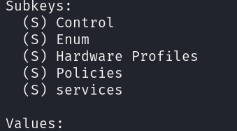
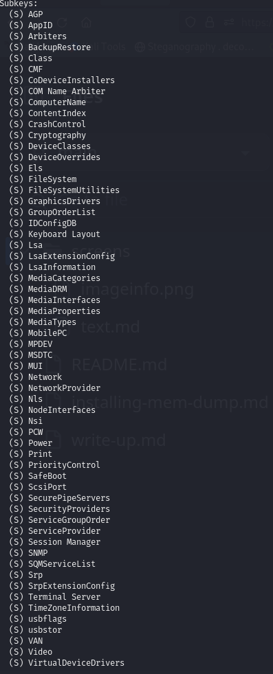
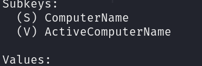

We possess a 'ch2.dmp' memory file with a size of 537 MB, indicating substantial RAM capacity. Initially, we will confirm the profile of this memory using Volatility 2
```bash
python2 ~/volatility/vol.py -f ch2.dmp imageinfo
```
we get this output here :


**so we confirmed that the profile is:** "--profile=Win7SP1x86_23418"
Next, we'll use the "hivelist" plugin to find the System host-name from the memory dump. This plugin lists the active registry hives, which are like specific folders in the Windows Registry—a digital filing cabinet that stores essential instructions for the computer's behavior and program settings. Each registry hive represents a dedicated section for specific configurations, such as personal preferences or system-wide settings.
by running this command : 

```bash
python2 ~/volatility/vol.py -f ch2.dmp --profile=Win7SP1x86_23418 hivelist
```
**Here, we obtain the registry hives:**


So what we will do to get the workstation's hostename from it?
First, we use the "printkey" option to specify the key value of the registry folder like this :
```bash
python2 ~/volatility/vol.py -f ch2.dmp --profile=Win7SP1x86_23418 printkey -o 0x8b21c008
```
Now we can see all subkeys of the system registry :


I guess that the first key is the right choose let's run it : 
```bash
python2 ~/volatility/vol.py -f ch2.dmp --profile=Win7SP1x86_23418 printkey -o 0x8b21c008 -K "ControlSet001"
```
**output**



 here we continue with the Control subkey using the back slash **"\"**  :

 ```bash
python2 ~/volatility/vol.py -f ch2.dmp --profile=Win7SP1x86_23418 printkey -o 0x8b21c008 -K "ControlSet001\Control"
```
Now, we have an extensive list of keys, resembling database tables:



If we carefully read through this key, we'll find our target key, "ComputerName," as we are specifically searching for the workstation hostname. Let's proceed with the final step :

 ```bash
python2 ~/volatility/vol.py -f ch2.dmp --profile=Win7SP1x86_23418 printkey -o 0x8b21c008 -K "ControlSet001\Control\ComputerName"
```

we check the "ActiveComputerName" key : 

```bash
python2 ~/volatility/vol.py -f ch2.dmp --profile=Win7SP1x86_23418 printkey -o 0x8b21c008 -K "ControlSet001\ControlComputerName\ActiveComputerName"
```
**And voila, we've successfully obtained the workstation's hostname!**


**which is: WIN-ETSA91RKCFP**

